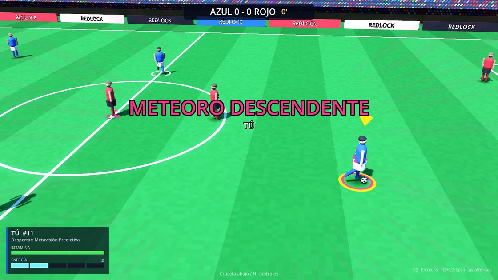
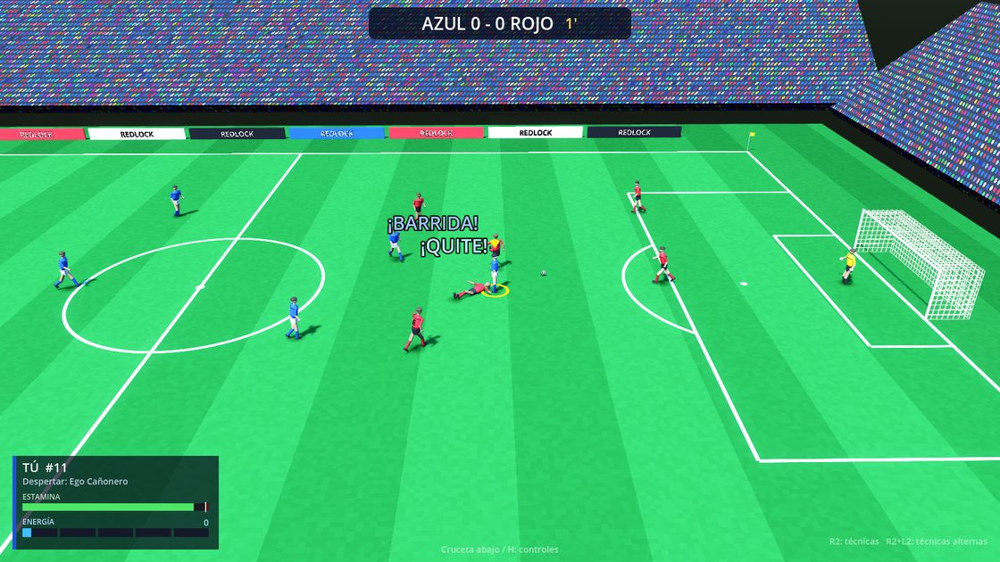
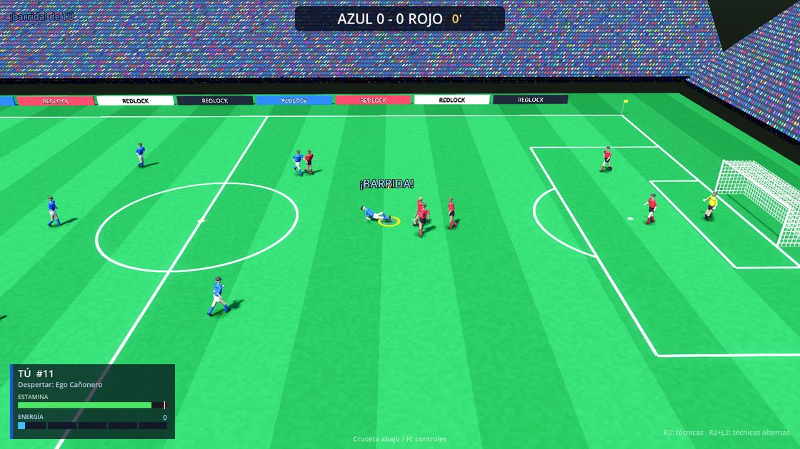
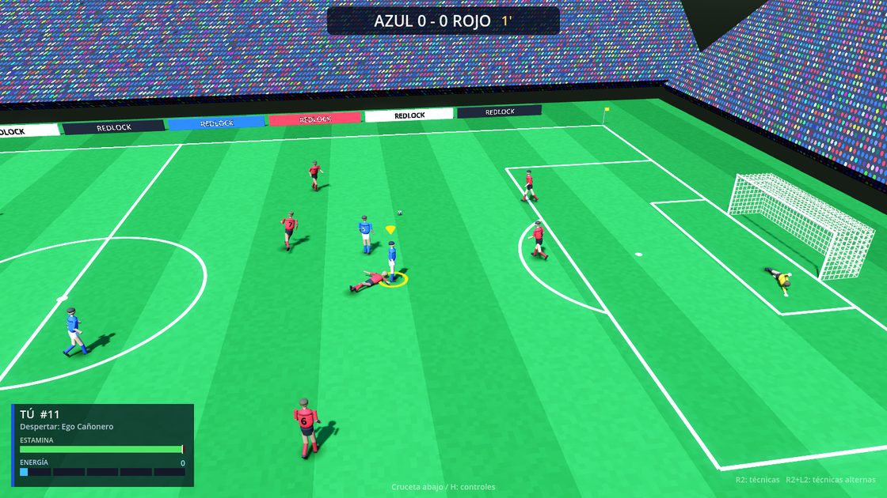
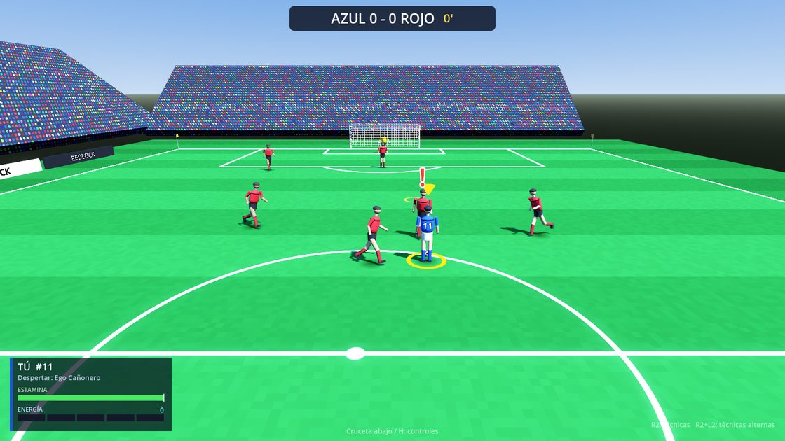
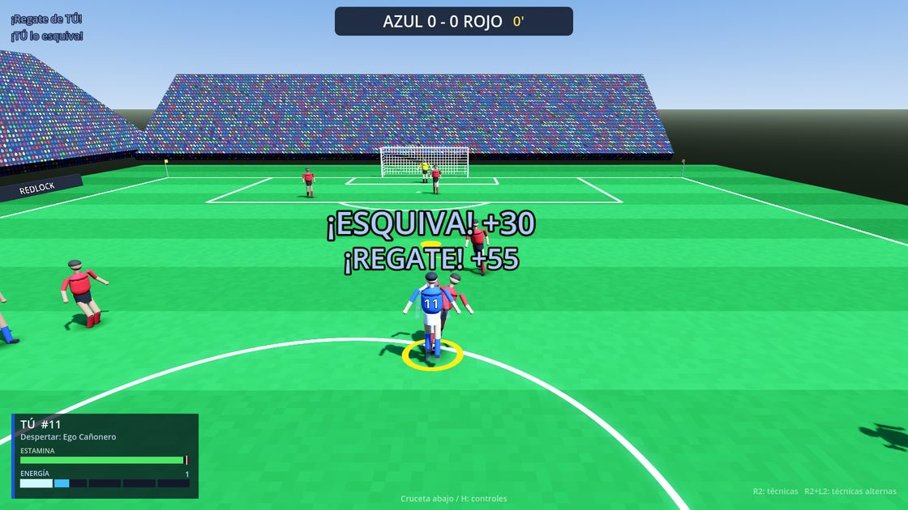

# Redlock Project

Prototipo de **gameplay** para un RPG de fútbol inspirado en *Blue Lock*, *Captain Tsubasa: Rise of New Champions* y el modo carrera de *FIFA*.
La meta de esta primera etapa es pulir el juego en la cancha: **arcade y fluido**, realista en las jugadas normales y espectacular
(cámara lenta, primeros planos, estelas, auras) en las técnicas especiales.

Motor: **Godot 4.3+** (GDScript). Gráficos sencillos generados por código: no hace falta ningún asset externo.



| Quite (el rival cae y aparece el aviso) | Barrida | Estirada del portero |
|---|---|---|
|  |  |  |

| La IA avisa el quite con "!" | Esquivar un quite |
|---|---|
|  |  |

## Cómo jugar

1. Instala [Godot 4.3 o superior](https://godotengine.org/download) (versión estándar, no hace falta la de .NET).
2. Abre Godot → *Importar* → elige `project.godot` de esta carpeta.
3. Pulsa **F5**. Conecta un mando (PlayStation, Xbox o genérico) antes o durante el menú.

En el menú eliges modo de control, formato (3v3, 5v5, 7v7 u 11v11), tipo de **Despertar**, dificultad, duración y cámara.

| Modo | Qué controlas |
|---|---|
| **Pro** | Solo a tu delantero creado (estilo Blue Lock / "Be a Pro"). Con Cruz/Triángulo pides el pase. |
| **Equipo** | Todo el equipo; el control salta al que tiene el balón o al mejor defensor. R3 cambia a mano. |
| **Espectador** | IA contra IA. |

## Controles

Pensados para mando de PlayStation (en Xbox: Cruz=A, Círculo=B, Cuadrado=X, Triángulo=Y). Entre corchetes, el teclado.

**El stick izquierdo funciona como un giroscopio:** pases y tiros salen hacia donde apunta. Si el compañero no está justo
en esa dirección, el pase sale hacia el stick y se cierra con efecto hasta él. Con el stick suelto, el juego asiste.

| Botón | Ataque (con balón) | Defensa (sin balón) |
|---|---|---|
| Stick izq. [WASD] | Moverse y apuntar | Moverse |
| **R1** [Shift] | Correr (los toques son más largos: más fácil que te roben) | Correr |
| **L2** [Q] | Proteger el balón | Marcar / contener (con stick quieto se coloca solo entre el rival y tu arco) |
| **L1** [E] | Modificador "picar": L1+Cuadrado vaselina, L1+Cruz pase bombeado, L1+Triángulo al hueco por arriba | Presionar (mantener). **Modo Equipo: toque corto = cambiar de jugador** |
| **Cruz** [K] | Pase al compañero **más cercano** en la dirección del stick (mantener = más fuerte) | Cargar con el cuerpo |
| **Triángulo** [I] | Pase **al hueco**: al espacio delante del compañero, hacia donde apunta el stick | — |
| **Círculo** [L] | Centro | Quite · **R1 + Círculo: barrida** |
| **Cuadrado** [J] | Tiro (mantener = potencia) · **R1 + Cuadrado: tiro curvo** | **Meter el pie** · mantener al lado del rival: **agarrar con el brazo** |
| Cuadrado ×2 | **Tiro raso** | — |
| Tiro + Cruz rápido | **Amague** (cancela el tiro) | — |
| **Stick der.** [flechas] | Regates: adelante *toque largo*, lado *recorte*, atrás *arrastre*; con L2: *sombrero*, *elástica*, *ruleta* | — |
| Balón suelto cerca | Cuadrado/Cruz = remate o pase **de primera** (cabezazo/volea automáticos) | |

**Tiros:** la mira (aro sobre el arco) muestra a dónde va el tiro mientras cargas; se pone **roja si va afuera**.
Apuntar lejos del arco, **pasarse de potencia** (se va por arriba) o el **tiro curvo** (mucho efecto, a veces se abre) pueden fallar.

**Paleta de técnicas (mantener R2, o R2 + L2), estilo Xenoverse 2.** Las 8 ranuras se eligen antes del partido en
**Kit de habilidades** (menú principal): puedes llevar, por ejemplo, dos tiros (uno curvo y uno directo) o dos regates.

| Tipo | Técnicas (barras de energía) |
|---|---|
| Tiro | Disparo Directo (2) · Curva del Ego (2) · Tiro Fantasma (2) · Meteoro Descendente (3) |
| Regate | Regate Fantasma (1) · Regate Relámpago (1) · Sombrero Celestial (2) · Torbellino (1) |
| Pase | Pase Meteoro (1) · Pase Bumerán (1) · Centro Teledirigido (1) |
| Defensa | Quite Relámpago (1) · Muro de Acero (1) |
| Transformación | Despertar (3) |

Kit por defecto: R2 + Cruz/Círculo/Triángulo/Cuadrado = Pase Meteoro, Quite Relámpago, Regate Fantasma, Disparo Directo;
R2 + L2 + Cruz/Círculo/Triángulo/Cuadrado = Centro Teledirigido, Despertar, Regate Relámpago, Curva del Ego.

Otros: cruceta ←/→ [1/2] cambia el tipo de Despertar, cruceta ↑ [3] energía al máximo (*debug*), cruceta ↓ [H] ayuda,
Select [C] cámara (TV / detrás del jugador), Start [Esc] pausa, R3 [R] cambiar de jugador (modo Equipo).

## Sistemas implementados

- **Estamina vs. energía.** La *estamina* se gasta al correr, marcar, chocar, saltar y regatear; al dejar de correr se recupera,
  pero **solo hasta un tope que baja con el cansancio** (la línea blanca de la barra). La *energía* (5 barras de 100) se gana
  jugando; lo que más da: **gol 160** (+20 a todo el equipo), **asistencia 90**, **regate que deja atrás al rival 40**
  (55 si fue un regate con L2), **esquivar un quite 30**, atajada 30, quite/intercepción 25. Se muestra sobre tu jugador.
- **Cuando te quieren quitar el balón**: la IA avisa con un **"!" rojo** un instante antes de entrar; si esquivas (amague,
  recorte, elástica...) aparece "¡ESQUIVA!" y el defensor queda descolocado; si aguantas, "¡RESISTE!"; si te la quitan, caes.
  Cada regate tiene su pose (amago de cuerpo en el recorte, pie por fuera y por dentro en la elástica, suela en el arrastre,
  taco en el sombrero) y deja estela.
- **Despertar (transformación)** durante 20 s, seis tipos: *Ego Cañonero* (tiro), *Cuerpo de Acero* (fuerza y resistencia),
  *Alas de Cóndor* (salto, cabezazos y voleas), *Velocidad Divina*, *Metavisión Predictiva* (marca dónde caerá el balón y una ruta;
  seguirla te acelera) y *Visión Espacial* (radar con el balón y las intenciones de los rivales; tus pases son más difíciles de cortar).
- **Física de balón propia**: rebote, rozamiento, resistencia del aire, curva por efecto (Magnus), caída por *topspin* y *knuckle*.
  Gravedad algo aumentada para que el balón no "flote" en la cámara de TV.
- **Conducción pegada al pie**: el balón va siempre delante, en la dirección en la que mira tu jugador (≈0,3–0,7 m al trote,
  hasta ≈1 m esprintando), con toques visibles. Con balón, el cuerpo gira hacia donde apuntas y en los giros bruscos el
  jugador recoge el balón al pie. Las recepciones amortiguan el pase en lugar de pegar el balón al pie.
- **Palos y travesaño**: el balón rebota según el ángulo con el que llega y el gol solo cuenta si cruza **entera** la línea.
- **Pases y tiros "giroscopio"**: salen hacia el stick; un solver calcula el efecto para que la curva termine en el compañero.
- **Lectura clara de las jugadas**: avisos grandes sobre la jugada (¡QUITE!, ¡ATAJADA!, ¡CORTADO!, ¡FALTA!...), congelado breve
  en los impactos, jugadores que caen al perder un duelo, guantes del portero y polvo en las barridas.
- **Animación procedural** con articulaciones (muslo/rodilla, brazo/codo): carrera, toques, armado y remate, quite,
  barrida, caída, estirada del portero, postura de marca y celebración.
- **Porteros** que predicen la trayectoria, se lanzan, atrapan o despejan (los rechazos quedan vivos para remates).
- **IA** por roles: presión, cobertura, marcajes, desmarques y carreras al espacio, pases según líneas de pase libres,
  tiros según ángulo/distancia y uso ocasional de técnicas.
- Reglas básicas: saques de banda, de esquina y de arco, faltas por barridas, **penales** y un fuera de juego aproximado
  para colocar a los atacantes.

## Estructura

```
scenes/            main_menu.tscn, match.tscn (todo lo demás se construye por código)
scripts/autoload/  game_config (opciones/perfil), input_setup (mapeo de mando), fx (efectos)
scripts/core/      match (partido), player, ball, kick (trayectorias), team, human_controller, camera_rig, skill_db
scripts/ai/        team_ai (roles), player_ai (decisiones y portero)
scripts/ui/        hud, hud_widgets (barras, paleta R2, radar), main_menu
shaders/           césped, balón, red, público, líneas de velocidad
tests/             pruebas headless (física, controles, partidos IA vs IA, capturas)
docs/              documento de diseño y hoja de ruta
```

Para ajustar el "feel": velocidades y estamina en `player.gd` (`max_speed`, `_update_resources`), fuerza de tiros en
`_kick_shot`, energía por acción en `SkillDB.GAIN`, técnicas en `SkillDB.SPECIALS` y dificultad de la IA en `match.gd` (`ai_*`).

## Pruebas

```bash
GODOT=/ruta/a/godot tests/run_tests.sh
```

Incluye: precisión de pases/centros/tiros y de los pases curvos, porcentaje de atajadas del portero, una batería que simula
el mando (pase al más cercano, pase curvo, al hueco, tiro al arco y desviado, potencia excesiva, tiro curvo, tiro raso, amague,
vaselina, regates, técnicas, despertar, quite, barrida, meter el pie, agarrar, cambio con L1, estamina) y partidos IA vs IA.

Más detalles de diseño y próximos pasos en [`docs/DISENO_GAMEPLAY.md`](docs/DISENO_GAMEPLAY.md).
